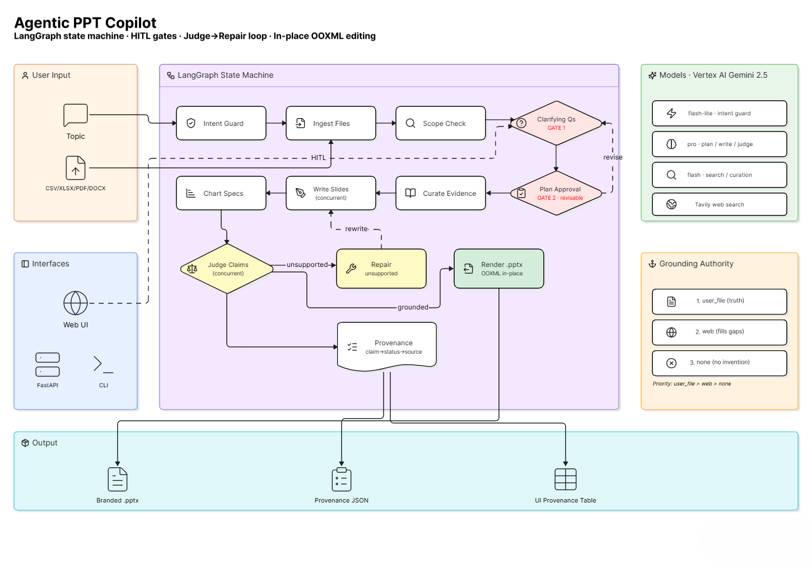

# Agentic PPT Copilot

Fills a **branded corporate PowerPoint template** with topic-specific,
source-grounded content — editing the template **in place at the XML level** so brand
structure, colours, fonts, swooshes and logo are preserved exactly, and only the content
(text, tables, SmartArt labels, chart visuals) is replaced.

Built as a **LangGraph** state machine with two human-in-the-loop gates, concurrent
slide writing, and an LLM **judge → repair** loop that checks every data-slide claim
against its evidence before the deck is rendered.



*Input → LangGraph state machine (two HITL gates · judge→repair loop · in-place OOXML editing) → branded `.pptx`, provenance JSON, and a UI provenance table.*

---

## Why it's built this way

- **In-place XML editing, not regeneration** — preserves the template byte-for-byte
  except where content is intended to change (regenerating with python-pptx loses brand fidelity).
- **Explicit grounding authority** — `user_file > web > none`. Uploaded files are ground
  truth; web fills gaps; nothing is invented.
- **Faithfulness loop** — a judge verifies each claim; unsupported claims are softened by
  a targeted rewrite, then re-rendered.
- **Two cheap human gates** — clarifying questions, then plan approval (with a revision
  loop) — *before* the minutes-long generation.
- **Provenance** — every run emits a `claim → status → source` record (grounded / softened
  / unsupported), surfaced in the UI and saved as JSON.

See **[docs/architecture_flow.md](docs/architecture_flow.md)** for the full design and the
graph diagram, and **[docs/project_structure.md](docs/project_structure.md)** for the repo map.

---

## Quickstart

```bash
# 1. install
pip install -r requirements.txt
pip install python-multipart            # required for file uploads

# 2. configure .env  (Vertex path)
#    USE_VERTEX=true
#    GOOGLE_CLOUD_PROJECT=<your-project>
#    GOOGLE_CLOUD_LOCATION=us-central1
#    TAVILY_API_KEY=<key>
gcloud auth application-default login

# 3. run the API + web UI
uvicorn backend.main:app --port 8000
#    open http://127.0.0.1:8000/
```

Then: enter a topic (optionally attach CSV/XLSX/PDF/DOCX source files) → answer the
clarifying questions → approve or revise the plan → watch it generate → download the
`.pptx` and review the provenance table.

---

## Interfaces

| Interface | Entry point | Use |
|---|---|---|
| **Web UI** | `http://127.0.0.1:8000/` (served by FastAPI) | Full gate flow, provenance table, deck download |
| **API** | `backend/main.py` | `POST /uploads`, `/sessions`, `/sessions/{id}/clarify`, `/plan`, `GET /sessions/{id}`, `/result`, `/deck` |
| **Terminal** | `python -m scripts.run_graph` | Headless HITL harness (questions, plan, summary, provenance) |
| **Smoke test** | `python smoke_test.py "<topic>" --files a.xlsx b.docx` | End-to-end check against a running server |

---

## How a run flows

```
topic (+ files) → intent guard → ingest files → scope check → clarifying Qs  [GATE 1]
   → plan  [GATE 2, revisable] → curate evidence → write slides (concurrent)
   → chart specs → judge claims (concurrent) → repair unsupported → render branded .pptx
```

Models: Gemini 2.5 family, routed per task in `ai/config.yaml` (flash-lite for the guard,
pro for planning/writing/judging, flash for search/curation). Grounding via uploaded files
first, Tavily web search only to fill gaps on data slides.

---

## Tech

LangGraph · LangChain · Vertex AI (Gemini 2.5) · Pydantic · python-pptx + lxml (OOXML
editing) · Tavily · FastAPI · vanilla HTML/CSS/JS frontend.

---

## Known boundaries (deliberate, for the assignment)

- In-memory checkpointer + in-process session store → single process; lost on restart.
  Production: `SqliteSaver`/`PostgresSaver` + Redis/DB.
- Provenance attribution is file/slide-level, not a verified per-claim locator.
- Generation is background + polling (not token streaming; SSE is the natural next step).
- File cap of 3 per deck (bounded cost/latency; configurable via `MAX_FILES`).