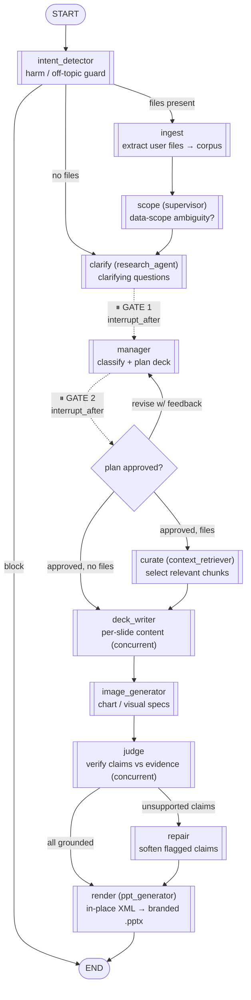

# Architecture & Flow

An agentic copilot that fills a **branded corporate PowerPoint template**
with topic-specific, source-grounded content — editing the template **in place at the
XML level** so brand structure, colours, fonts, swooshes and logo are preserved exactly,
and only the *content* (text, tables, SmartArt labels, chart visuals) is replaced.

The system is a **LangGraph state machine** with two human-in-the-loop (HITL) gates,
deterministic rendering, and a faithfulness **judge → repair** loop. Every reasoning
step is a typed agent; every claim on a data slide is checked against evidence before
the deck is rendered.

---

## 1. The design thesis (what makes this different)

| Decision | What we do | Why (and the alternative we rejected) |
|---|---|---|
| **In-place XML editing** | Unpack the `.pptx`, mutate only the runs/cells/labels/chart caches, repack. | Regenerating slides with python-pptx loses brand fidelity (swooshes, exact colours, SmartArt geometry). Editing the OOXML preserves the template byte-for-byte except where we intend to change it. |
| **Grounding authority** | `user_file > web > none`. Uploaded files are ground truth; web fills gaps; nothing invented. | A deck that quietly invents figures is worse than one that says "stated qualitatively." Authority ranking makes the precedence explicit and auditable. |
| **Judge → repair loop** | An LLM judge checks every data-slide claim against the evidence; unsupported claims are softened by a targeted rewrite, then re-rendered. | Trusting the writer's first draft is how hallucinated statistics reach a client deck. The judge is a second, independent pass. |
| **Two HITL gates** | Gate 1: clarifying questions. Gate 2: plan approval (with a revision loop). | A long generation built on the wrong assumptions wastes minutes and tokens. Cheap human checkpoints *before* the expensive work. |
| **Typed agents** | Each reasoning node returns a validated Pydantic object (one retry on failure, then raise). | Free-text passing between agents is fragile. Typed contracts make the graph debuggable and the fit-limits enforceable at validation time. |
| **Provenance record** | A `claim → status → source` JSON is produced for every run (grounded / softened / unsupported, with file or URL sources). | "Trust me" is not acceptable for a financial deck. Provenance makes the grounding inspectable per claim. |

---

## 2. The graph

**HITL mechanics.** The graph is compiled with `interrupt_after=["clarify", "manager"]`
and a checkpointer keyed by `thread_id`. At each gate the graph *pauses*; the caller
(terminal harness or FastAPI) reads the pending question/plan, collects the human's
answer, writes it back into state with `update_state`, and resumes with `invoke(None)`.
The plan-revision loop is a conditional edge from `manager` back to itself: feedback →
re-plan → pause again, until approved.

---

## 3. Node-by-node

1. **intent_detector** (`gemini-2.5-flash-lite`) — a cheap guard. Blocks harmful or
   clearly out-of-scope requests; otherwise routes to ingest (if files) or clarify.
2. **ingest** (`context_retriever`) — extracts uploaded files (xlsx/docx/pdf/csv) into a
   session-scoped corpus, deduped and capped (first 3 files; ~token budget). Non-LLM.
3. **scope** (`supervisor`) — the one genuinely *agentic* routing call: with files present,
   an LLM judges whether the data scope is ambiguous (industry-wide vs the user's own
   data) and, if so, surfaces one scope question for gate 1. Degrades safely to "no
   question" on failure — never blocks the run.
4. **clarify** (`research_agent`) — produces a short list of clarifying questions, each
   with 2–4 tappable suggestions. **Gate 1** pauses here.
5. **manager** (`gemini-2.5-pro`) — classifies the request and plans the deck: picks
   layouts + titles + data/narrative kind per slide. Hard-dedups layouts (each template
   layout exists once physically, so a layout cannot repeat) and writes a first-person
   `note` when a request can't be honoured literally. **Gate 2** pauses here; feedback
   loops back for a re-plan.
6. **curate** (`context_retriever`) — when files exist, an LLM selects the chunks relevant
   to the approved agenda (keeps the writer's context focused and small).
7. **deck_writer** (`gemini-2.5-pro`) — writes each slide's content as a typed object,
   **concurrently** in a bounded thread pool (`max_workers`). Grounds on user-file evidence
   first; falls back to **web_search** (Tavily) only for a data slide with no file coverage.
   A deterministic fit-validator triggers at most one tightening retry.
8. **image_generator** (`gemini-2.5-pro` plan → image model) — produces chart/visual specs
   for chart slides; the renderer swaps the PNG fallback inside the embedded chart.
9. **judge** (`gemini-2.5-pro`) — verifies every **data** slide's claims against the
   combined evidence (curated files + per-slide web), honouring source authority.
   Concurrent. Narrative slides are not claim-checked (reported as conceptual).
10. **repair** — for any slide with unsupported claims, one targeted rewrite softens them
    to qualitative statements (preserving any chart/SmartArt already produced).
11. **render** (`ppt_generator`) — deterministic. Applies the finalized content to a
    per-run unpacked copy of the template via the rendering layer, repacks to `.pptx`,
    and logs a grounding summary. The template in `assets/` is never mutated.

---

## 4. Grounding & provenance

Evidence flows with explicit **authority**: `user_file` (curated, whole-deck ground
truth) > `web` (per-slide Tavily results) > `none`. The judge sees both file and web
evidence so file-sourced figures are never wrongly flagged.

After render, a pure-logic module assembles a **provenance record** (`runs/<id>/provenance.json`):
for each slide, each claim's `status` (grounded / softened / unsupported), its `authority`,
and its `source`. Web claims carry clickable `{title, url}` chips (slide-level attribution);
file claims cite "Uploaded files" (the actual filenames are listed once at deck level);
narrative slides are marked conceptual. The deck itself stays clean — provenance is a
side artifact for the UI and audit, not baked into the `.pptx`.

**Honest scope:** attribution is at the file/slide level, not a verified per-claim locator
(the judge emits `authority`, not "this claim came from row 12"). Per-claim URL/cell
locators are a deliberate future enhancement.

---

## 5. Speed, observability, resumability

- **Concurrency.** `deck_writer` and `judge` fan out across a bounded `ThreadPoolExecutor`
  (`max_workers`). LLM calls are I/O-bound, so a thread pool (not asyncio) is the right
  tool for these sync calls — roughly 3× faster writing on a typical deck.
- **Logging.** A two-sink logger: a console stream (with a `«slide N»` tag bound per
  thread so concurrent work stays legible) and a per-run JSON-lines file
  (`runs/<id>/run.log`), plus a slide-regrouped view (`run_by_slide.log`). Each node logs
  start, its true model+temperature per invoke, and a closing grounding summary.
- **Resumability.** A LangGraph checkpointer persists state per `thread_id`, which is what
  makes the two interrupts resumable across separate HTTP calls.

---

## 6. Interfaces

- **`scripts/run_graph.py`** — terminal HITL harness (prints questions, plan, summary,
  provenance table).
- **`backend/main.py`** — FastAPI wrapper. The graph is the source of truth; each endpoint
  resumes it at a checkpoint. Background generation + polling; uploads staged per session;
  provenance returned in the result. See its header for documented production boundaries
  (in-memory checkpointer/session store; per-run file logging on a shared root logger).
- **`frontend/index.html`** — a single-file branded client (gate stepper, suggestion chips,
  plan approval/revision, live progress, provenance table with status chips and source
  links, deck download). Served same-origin by FastAPI.

---

## 7. Known boundaries (deliberate, for this assignment)

- In-memory checkpointer + in-process session dict → single process; lost on restart.
  Production: `SqliteSaver`/`PostgresSaver` + Redis/DB.
- Provenance attribution is file/slide-level, not per-claim locator.
- Generation is background + polling, not token streaming (SSE is a natural next step).
- File cap of 3 per deck (bounded cost/latency; raise `MAX_FILES` to relax).
